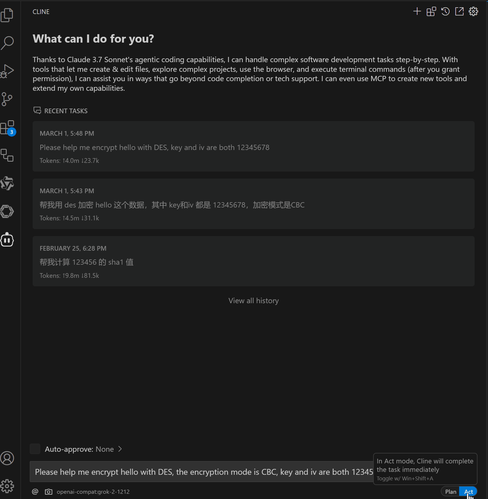

<div align="center">
    
    <h1>Crypto_MCP</h1>
    <p>
        <strong>A Model Context Protocol (MCP) server for encrypting/decrypting/algorithm/hash</strong>
    </p>
    <p>
        
        
<a href="https://smithery.ai/server/@1595901624/crypto-mcp"></a>
    </p>
</div>

## 📝 Description

A Model Context Protocol (MCP) server for encrypting/decrypting/algorithm/hash.

## 📺 Demo



## ✨ Features

- [x] Support AES encryption and decryption (128 bits)
  - Support mode: ECB, CBC, CFB, OFB, CTR
  - Support padding mode: Pkcs7, Iso97971, AnsiX923, Iso10126, ZeroPadding, NoPadding.
  - Support output format: base64, hex
  - Support input format: base64, hex
- [x] Support MD5, SHA1, SHA256, SHA384, SHA512, SHA224 algorithm
- [x] Support DES encryption and decryption (64 bits)
  - Support mode: ECB, CBC, CFB, OFB, CTR
  - Support padding mode: Pkcs7, Iso97971, AnsiX923, Iso10126, ZeroPadding, NoPadding.
- [x] Support Base64 encode and decode
- [x] Support Hex encode and decode

## 🔮 Comming Soon

- [ ] Support more encryption and decryption algorithms

## 📦 Installation

### Installing via Smithery

To install Crypto_MCP for Claude Desktop automatically via [Smithery](https://smithery.ai/server/@1595901624/crypto-mcp):

```bash
npx -y @smithery/cli install @1595901624/crypto-mcp --client claude
```

### Manual Installation

1. Clone the Repository

```
git clone https://github.com/1595901624/crypto-mcp.git
```

2. Install Dependencies

```
pnpm install
```

3. Build the Project

```
pnpm run build
```

4. Add to your Claude Desktop MCP settings file

```
{
   "mcpServers": {
    "crypto-mcp": {
      "command": "node",
      "args": ["path/to/crypto-mcp/build/index.js"],
      "disabled": false,
      "autoApprove": []
    }
  }
}
```

## 🔧 Usage

### Available Tools

#### AES

- `aes_encrypt`: Encrypt text with AES
  parameters:

  - `text`: The text to encrypt (**Required**)
  - `key`: The key to encrypt the text (optional, default is your-key-0123456)
  - `padding`: The padding mode (optional, default is Pkcs7)
  - `outputFormat`: The output format (optional, default is base64)
  - `iv`: The initialization vector (optional, default is your-iv-01234567)
  - `mode`: The mode to encrypt the text (optional, default is ECB)

- `aes_decrypt`: Decrypt text with AES
  parameters:

  - `text`: The text to decrypt (**Required**)
  - `key`: The key to decrypt the text (optional, default is your-key-0123456)
  - `padding`: The padding mode (optional, default is Pkcs7)
  - `inputFormat`: The input format (optional, default is base64)
  - `iv`: The initialization vector (optional, default is your-iv-01234567)
  - `mode`: The mode to decrypt the text (optional, default is ECB)

#### Digest

- `md5`: Calculate MD5 hash of a string
  parameters:

  - `input`: The input string to hash (**Required**)

- `sha1`: Calculate SHA-1 hash of a string
  parameters:

  - `input`: The input string to hash (**Required**)

- `sha256`: Calculate SHA-256 hash of a string
  parameters:

  - `input`: The input string to hash (**Required**)

- `sha384`: Calculate SHA-384 hash of a string
  parameters:

  - `input`: The input string to hash (**Required**)

- `sha512`: Calculate SHA-512 hash of a string
  parameters:

  - `input`: The input string to hash (**Required**)

- `sha224`: Calculate SHA-224 hash of a string
  parameters:

  - `input`: The input string to hash (**Required**)

#### DES

- `des_encrypt`: Encrypt text with DES
  parameters:

  - `text`: The text to encrypt (**Required**)
  - `key`: The key to encrypt the text (optional, default is your-key)
  - `padding`: The padding mode (optional, default is Pkcs7)
  - `outputFormat`: The output format (optional, default is base64)
  - `iv`: The initialization vector (optional, default is your-iv-)
  - `mode`: The mode to encrypt the text (optional, default is ECB)

- `des_decrypt`: Decrypt text with DES
  parameters:

  - `text`: The text to decrypt (**Required**)
  - `key`: The key to decrypt the text (optional, default is your-key)
  - `padding`: The padding mode (optional, default is Pkcs7)
  - `inputFormat`: The input format (optional, default is base64)
  - `iv`: The initialization vector (optional, default is your-iv-)
  - `mode`: The mode to decrypt the text (optional, default is ECB)

#### Base64

- `base64_encode`: Encode text to base64
  parameters:

  - `content`: The text to encode (**Required**)

- `base64_decode`: Decode base64 to text
  parameters:

  - `content`: The base64 text to decode (**Required**)

#### Hex

- `hex_encode`: Encode text to hex
  parameters:

  - `content`: The text to encode (**Required**)

- `hex_decode`: Decode hex to text
  parameters:

  - `content`: The hex text to decode (**Required**)

  
## 📝 Development

```
# Install dependencies
npm install

# Build the project
npm run build

# Development with auto-rebuild
npm run watch
```

## 📝 License

This project is licensed under the MIT License. See the [LICENSE](LICENSE) file for details.
